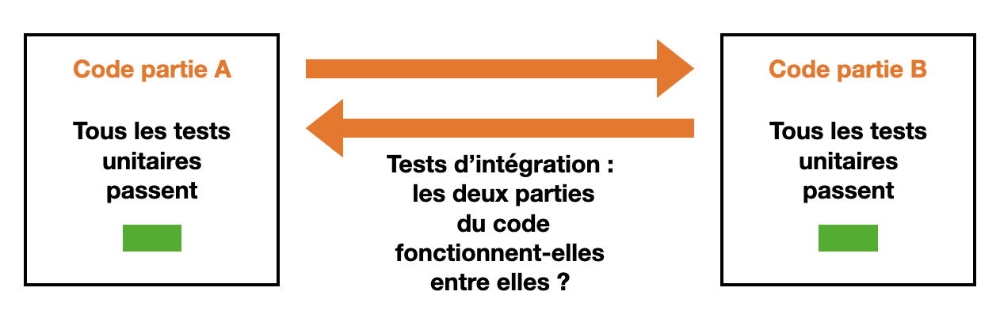
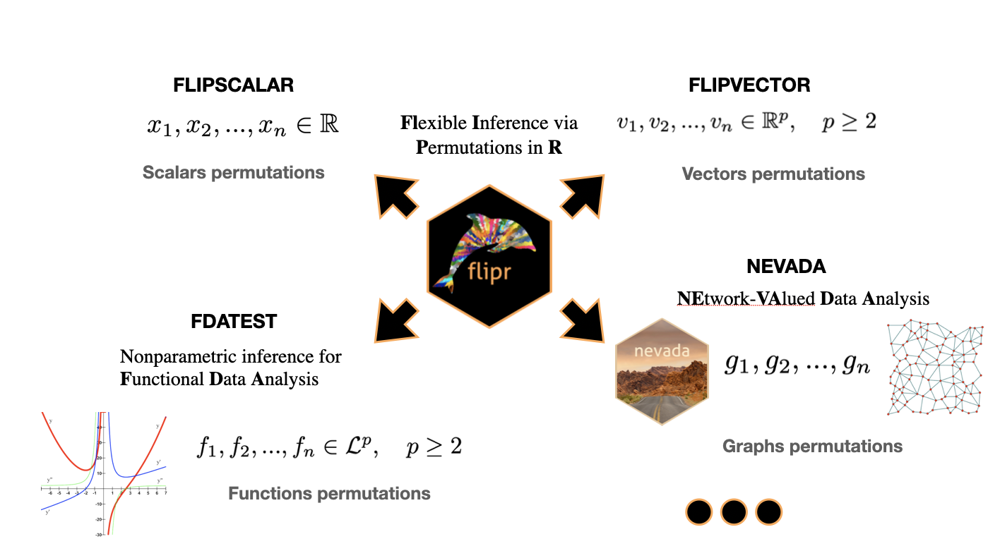

\newtcolorbox{blackbox}{
  colback=white,
  colframe=orange,
  coltext=black,
  boxsep=50pt,
  arc=4pt}


\newpage
\tableofcontents
\newpage

```{r setup, include=FALSE}
knitr::opts_chunk$set(echo = TRUE)
```
# Introduction  {-#Introduction}
\vspace{0.5cm}

 Le stage a été initié à ma demande car je souhaitais apprendre différentes pratiques relatives à la programmation, appliquées dans un contexte mathématique. Ces pratiques concernaient : 
 \begin{itemize}
  \item la création de classes dans R et Python,
 \item l'utilisation de tests unitaires dans le développement de fonctions/packages destiné(e)s à des utilisateurs,
 \item une meilleure connaissance de ggplot2,
 \item la création de packages,
 \item la création de belles visualisations,
 \item l'utilisation du débugger dans Rstudio,
 \item le clean code.
\end{itemize}

 
 Mon encadrant de stage, Aymeric Stamm, m'a proposé de travailler sur un des packages qu'il développe en R et Python : le package *flipr* en R (et *flippy* en Python). Participer au développement de *flipr* devait en effet me permettre d'effectuer une phase de recherche documentaire puis de mettre en pratique les compétences précédemment citées. J'avais de plus demandé à pouvoir davantage coder en Python qu'en R par simple préférence.
 
 Nous avons donc intitulé le stage de la façon suivante : 
 
 \begin{center}
 « Bonnes pratiques pour le développement collaboratif de logiciel : application au
développement d’un module Python autour de l'inférence statistique par permutation avec implémentation de tests unitaires. »
\end{center}

Et nous avons défini les activités prévues de la manière suivante :

- Réalisation des tests unitaires du package R *flipr*,
- Portage du package R *flipr* en Python via la réalisation d’un module Python dédié.

Le stage a commencé quelques mois plus tard. Entre temps, avec deux de mes camarades de promotions, Céline et Léonie, nous avons rendu un projet en R portant sur une problématique de géostatistique \footnote{Il s'agissait du projet SSPM (Supervised Study Project in Mathematics), réalisé avec l'encadrement de Monsieur Nicolas Bez et intitulé « créer des champs aléatoires structurés spatialement par méthodes à noyaux ».}. En plus du fait qu'il m'ait permis de beaucoup mieux manipuler le code R, ce projet contenait un certain nombre de fonctions que nous avions codées et nous avons convenu avec mon tuteur, Aymeric Stamm, qu'un bon entraînement pour que je découvre la manière de créer des packages en R serait de rassembler l'ensemble de ces fonctions dans un package que je créerai. 

Le stage a donc débuté ainsi, par la création d'un package R à partir d'un ensemble de fonctions déjà implémentées. Cela correspondra à la première partie de ce rapport. La mise en ligne de documents et plus particulièrement de code et de package sur Github est aussi expliquée à cet endroit.

Ensuite, nous avons discuté du fait de concevoir une Shiny App (une application) avec des fonctionnalités faisant appel à ce code. La conception de cette Shiny App est expliquée dans la deuxième partie du rapport.

En parallèle de ces premières considérations, nous avons envisagé de tester le code avec des tests unitaires. Cette étape a été un des points centraux du stage. Tout le développement concernant les tests unitaires en particulier, et les tests utilisé en informatique en général, constitue la troisième partie du rapport.

Ayant rodé la méthode de test avec le package simple issu du projet en géostatistique réalisé dans l'année, nous avons alors convenu du fait que je pouvais commencer à travailler sur le package développé par Aymeric Stamm, à savoir *flipr*. Le fonctionnement de *flipr* est exposé dans la quatrième partie du rapport.

\vspace{1cm}


\newpage
# Création d'un package R
\vspace{0.5cm}

Le projet de géostatistique que nous avons rendu, Céline, Léonie et moi, nous avait permis de mettre en place un code R regroupant plusieurs fonctions. Ce sont ces fonctions qui ont été reprises pour la création du package. Nous allons tout d'abord rappeller ces fonctionnalités. Puis, cette partie présentera les étapes de création d'un package R. Enfin, nous verrons comment mettre le package en ligne sur Github et comment installer les badges servant à vérifier que le package fonctionne et que le code est couvert par des tests unitaires.

\vspace{0.5cm}
## Le package : méthode à noyau - champs aléatoires structurés
\vspace{0.5cm}

Le package R, qui reprend les fonctions codées dans le projet rendu en cours d'année, a pour but de permettre les opérations suivantes :

- représenter des matrices (grilles) $Z$ par des grilles de couleurs, 
- créer de nouvelles grilles $Y$ par moyenne glissantes sur des grilles $Z$ existantes (méthode à noyau où le noyau est une fonction moyenne). La moyenne glissante a pour support une fenêtre (glissante). 

On se place ensuite dans le cadre spécifique de grilles $Z$ générées aléatoirement à partir de lois statistiques connues. Les matrices $Z$ n'ont donc pas de structures spatiales. En revanche, les grilles $Y$ possèdent des structures spatiales. C'est une conséquence de la moyenne glissante : certains couples de points (ceux issus de fenêtres qui se recouvrent) ont une covariance non-nulle. On peut montrer que cette covariance ne dépend que de la distance entre les points (stationnarité d'ordre 2). Il est alors possible de : 

- construire de façon empirique le graphique de la covariance en fonction de la distance entre deux points d'une grille structurée $Y$,
- établir ce graphique de façon théorique : il suffit de connaître l'écart-type de la loi ayant servi à générer la grille initiale $Z$.

Enfin, le package assure aussi la fonctionnalité de :

- réaliser des moyennes par blocs,
- calculer la perte de variance suite à ces moyennes par blocs.

\vspace{0.5cm}
## Etapes de création et de développement de package R
\vspace{0.5cm}
Cette section résume les étapes de la création de package en R. Elle s'appuie sur la documentation suivante [https://r-pkgs.org](https://r-pkgs.org).L'ensemble de la procédure est récapitulée sur la Figure 1 ci-dessous.

\vspace{0.5cm}
### Initialisation du package (étapes à ne faire qu'une seule fois)
\vspace{0.5cm}

\vspace{0.5cm}
**Librairies utiles**
\vspace{0.5cm}

Avant toute chose, la librairie *devtools* est à installer et charger pour pouvoir créer et développer un package. Il est possible la charger systématiquement par défaut en ajoutant au fichier **.Rprofil** (fichier caché, installé par défaut avec R) les lignes : 

\vspace{0.5cm}
```{r}
if (interactive()){
suppressMessages(require(devtools))
}
```
\vspace{0.5cm}
On peut également rajouter dans le *if* la ligne : 

\vspace{0.5cm}
```{r}
suppressMessages(require(testthat))
```
\vspace{0.5cm}

si l'on souhaite que la librairie permettant de faire des tests unitaires (voir troisième partie du rapport), *testthat*, soit également chargée par défaut.

\vspace{0.5cm}
**Création du package**
\vspace{0.5cm}

Entrons désormais dans le vif du sujet. La commande *create_package("chemin/Nomdupackage")* permet de créer un nouveau package à l'endroit voulu. A cette occasion sont crées plusieurs éléments :

- un dossier **R** qui contiendra les fonctions,
- un fichier **NAMESPACE**, qui déclare les fonctions à exporter (celles du package) et celles à importer (celles provenant de d'autres packages),
- un fichier **DESCRIPTION**, déclarant entre autre le nom de l'auteur, la license et les éventuels autres packages utilisés,
- une session R : **Nomdupackage.Rproj**, qui s'ouvre automatiquement, et qui sera à systématiquement utiliser pour ce projet.
- des fichiers cachés : **.Rbuildignore** (déclare les fichiers à ignorer lorsque le package est *built*), **.gitignore**, qui anticipe l'usage de Git et spécifie certains fichiers à ignorer par Git, **.Rproj.user** qui est un dossier interne à RStudio.  

\vspace{0.5cm}
**Fichier DESCRIPTION**
\vspace{0.5cm}

Le fichier **DESCRIPTION** peut alors être complété avec le nom du ou des auteur(s), et avec un titre détaillé (champ *Title*) et une description (champ *Description*).

\vspace{0.5cm}
**License**
\vspace{0.5cm}

Vient ensuite le choix de la license. Le site officiel conseille la licence MIT : *use_mit_license("Prénom Nom")*, mais différents choix sont possibles. Voir : [https://r-pkgs.org/license.html](https://r-pkgs.org/license.html). Les fichiers **LICENSE** et **LICENSE.md** sont alors créés.

\vspace{0.5cm}
**README : une aide pour les utilisateurs**
\vspace{0.5cm}

Enfin, les fichiers **README.md** et **README.rmd**, donnant une description du package aux utilisateurs, peuvent être générés avec les commandes *use_readme_rmd()* et *build_readme()*. Ils sont à compléter.

La phase d'écriture des fonctions ou des classes peut maintenant commencer.

\vspace{0.5cm}
### Développement du package (étapes à faire de façon cycliques)
\vspace{0.5cm}

On se place toujours dans la session R du **Nomdupackage.Rproj**.

\vspace{0.5cm}
**Création de fonction**
\vspace{0.5cm}

Pour créer une fonction, on utilise la commande *use_r("Nom_de_la_fonction")*. Cela crée un fichier **Nom_de_la_fonction.R** dans le dossier **R**. On peut alors écrire la fonction dans ce nouveau fichier. Si la fonction a besoin d'appeller des fonctions d'autres packages, il est possible d'utiliser la commande *use_package()*. Cela ajoutera le nom du nom package appelé aux imoprt du fichier **DESCRIPTION**. Par exemple, si l'on souhaite utiliser ggplot2, on écrira *use_package("ggplot2")*. Ensuite, on peut utiliser les fonctions du package en utilisant la syntaxe "::" pour spécifier l'appartenance des fonctions à ce package. Par exemple *ggplot2::aes*. Autre possibilité si la syntaxe avec les deux points alourdie vraiment trop le code (comme dans le cas de ggplo2) : rajouter une ligne

```{r, eval=FALSE}
#' @import ggplot2
```

dans la documentation de la fonction (voir le paragraphe sur la documentation). On peut alors appeler directement les fonctions voulues sans avoir recours à la syntaxe avec les deux points.
On peut noter de penser à limiter le nombre de dépendences avec d'autres packages. Cela évite aux utilisateurs de notre package d'installer d'autres packages non-voulus sur leur ordinateur. On peut éventuellement recoder des fonctions pour limiter les dépendances. 

La commande *load_all()* permet de charger le package et de rendre la fonction disponible. Les raccourcis clavier sont : CRTL + SHIFT + L pour Windows et Linux et CMD + SHIFT + L pour Mac OS.

\vspace{0.5cm}
**Tests unitaires**
\vspace{0.5cm}

Il est possible de mettre en place des tests unitaires pour vérifier que la fonction se comporte bien comme attendue (voir la troisième partie du rapport pour la procédure détaillée des tests). La mailleure pratique (le Test Driven Developpement) est même d'écrire chaque test en amont, avant d'écrire les lignes correspondantes dans la fonction. Cependant, si cela est considéré comme la meilleure pratique de développement, cela n'influe pas sur la création du package à proprement parler. Nous conseillons tout de même d'écrire des tests, avant ou après l'écriture de la fonction. Pour cela, on utilise les deux commandes successives :

```{r, eval=FALSE}
use_testthat()
use_test("Nom_de_la_fonction")
```

Un dossier **test** apparaît lorsque ces commandes sont exécutée pour la première fois. Dedans se trouvent les fichiers de tests des fonctions du package. Un modèle d'écriture de test est présenté par défaut dans le fichier de test **test-Nom_de_la_fonction".R** créé. Pour exécuter les tests du fichier, on peut cliquer sur l'icone "Run tests" en haut à droite dans RStudio. Mais on peut aussi faire tourner l'ensemble des tests (de toutes les fonctions que l'on aura créé) avec la commande *test()*. Les raccourcis clavier correspondant à cette commande sont les suivants : CRTL + SHIFT + T pour Windows et Linux et CMD + SHIFT + T pour Mac OS.

\vspace{0.5cm}
**Documentation**
\vspace{0.5cm}

La fonction a également besoin d'une documentation ! Elle est essentielle pour que le package compile correctement. Pour cela, on place le curseur quelque part sur notre fonction et on ouvre le menu *Code* puis on clique sur *Insert Roxygen Skeleton*. Il suffit ensuite de compléter les champs. C'est dans ce squelette qu'on peut ajouter une entrée (#' @import ggplot2 par exemple) si besoin est, comme expliquée dans le paragraphe sur l'importation de package.

La commande *document()* est alors à exécuter. Les raccourcis clavier sont : CRTL + SHIFT + D pour Windows et Linux et CMD + SHIFT + D pour Mac OS. Cela écrit le nom de la fonction dans le fichier NAMESPACE (et ajoute un dossier **man** la première fois que la commande est exécuté : on ne s'attardera pas sur ce dossier).

Si on exécute à nouveau *load_all()* (CRTL + SHIFT + L pour Windows et Linux et CMD + SHIFT + L pour Mac OS), la fonction ET sa documentation deviennet accessibles.

\vspace{0.5cm}
**Vérification du bon fonctionnement du package**
\vspace{0.5cm}

Il est temps de vérifier que l'ensemble du package fonctionne. Pour cela on utilise la commande *check()* (raccourcis : CRTL + SHIFT + E pour Windows et Linux et CMD + SHIFT + E pour Mac OS). Si d'éventuels erreurs, warnings ou notes sont renvoyés, ils sont à corriger.

\vspace{0.5cm}
**Installation**
\vspace{0.5cm}

Dernière étape (non-obligatoire) : l'installation du package sur votre ordinateur. Il suffit d'exécuter la commande *install()*. Ensuite on peut appeller le package avec la commande *library(Nomdupackage)* depuis n'importe quelle session R.

Toutes ces étapes sont résumées sur le schéma "Cheat sheet R packages". Elles sont appellées à être répétée de nombreuses fois, à chaque fois que l'on crée une nouvelle fonction (ou une nouvelle classe).


\newpage

\vspace{0.5cm}
## Mise en ligne sur Github 
\vspace{0.5cm}


Git et github, utilisation

Détail de la mise en place sur github de R-check-rmd, codecoverage

\newpage
# Création d'une Shiny App
\vspace{0.5cm}
UI, server, reactivité


\newpage
# Informatique : test du code et bonnes pratiques
\vspace{0.5cm}
Cette troisième partie aborde un sujet portant sur l'informatique en laissant de côté les mathématiques. Elle  traite le sujet des tests en informatique et conclut sur quelques bonnes pratiques de développement en général. Elle expose tout d'abord quelques grands types de tests (seront présentés succintement les tests unitaires, les tests d'intégration, les tests fonctionnels, les tests de validation et les golden tests) et détaille les raisons pour lesquelles il est important d'écrire ces tests. Une section sera ensuite dédiée plus particulièrement aux tests unitaires pour préciser les pratiques usuelles à propos de quoi tester, comment tester, et comment évaluer la qualité des tests. Puis, le sujet des tests d'intégration sera lui aussi abordé avec quelques considérations sur leurs avantages et leurs inconvénients par rapport aux tests unitaires. Nous nous en tiendrons au détail de ces deux premiers niveaux : tests unitaires et tests d'intégrations.


Cette troisième partie s'appuie sur la synthèse de différentes conférences Devox (the developer community conference) et vidéos suivies sur youtube et de quelques documents supplémentaires en ligne.
\vspace{0.3cm}
Les vidéos/conférences suivies sont les suivantes : 
\vspace{0.3cm}
\begin{itemize}
 \item « Effective Unit Testing by Elliotte Rusty Harold » \\
 Elliotte Rusty Harold : actuellement Tech Lead de Google Cloud Tools (outils pour les dévelopeurs de Google Cloud) pour Eclipse. \\
 
  \vspace{-0.5cm}
 \underline{https://www.youtube.com/watch?v=fr1E9aVnBxw}
\vspace{0.2cm}
 
 \item « Write awesome tests by Jeroen Mols » \\
 Développeur chez PHILIPS pour l'application Philips Hue. 
 Et développeur expert chez Android. \\
 
 \vspace{-0.5cm}
 \underline{https://www.youtube.com/watch?v=F8Gc8Nwf0yk}
 \vspace{0.2cm}
 
  \item « Victor Rentea - Unit Testing like a Pro: The Circle of Purity» \\
  Entre autres, lead architect chez IBM.
  
   \vspace{-0.5cm}
 \underline{https://www.youtube.com/watch?v=1Z\_h55jMe-M}
 \vspace{0.2cm}
 
  \item « Unit tests vs. Integration tests - MPJ's Musings - FunFunFunction \#55 » \\
 Chaîne youtube de vulgarisation à propos du code \\
 
  \vspace{-0.5cm}
 \underline{https://www.youtube.com/watch?v=vqAaMVoKz1c}
\end{itemize}


\vspace{0.5cm}
## Présentation générale des tests
\vspace{0.5cm}

Développer un programme nécessite de vérifier qu'il fonctionne et ce à différents niveaux : c'est l'objectif des tests en informatique. Voici donc les différents types de tests possibles, présentés en partant des tests exécutant les opérations les plus élémentaires jusqu'aux tests réalisant des vérifications beaucoup plus globales. C'est une classification possible qui est présentée, elle n'a pas vocation à être unique ni unanime.

\vspace{0.5cm}
**Tests unitaires**
\vspace{0.2cm}

Les tests vérifiant les opérations les plus élémentaires sont les tests unitaires. Comme leur nom l'indique, ils sont ceux qui testent les opérations unitaires du code, c'est-à-dire les opérations qu'on ne peut pas diviser en sous-opérations. Ils sont écrits tout au long de la phase de développement du code, en parallèle avec celui-ci. Le lancement des tests unitaires peut se faire à la main : il est conseillé de lancer le fichier de tests très régulièrement, à chaque modification du code. Mais ces tests sont aussi mis en place de façon à être exécutés de manière automatique à chaque fois que le code est actualisé en ligne sur github par exemple.  

\vspace{0.5cm}
**Tests d'intégration**
\vspace{0.2cm}

Une fois que plusieurs parties du code (par exemple des modules) sont écrites et que tous leurs tests unitaires passent avec succès, il faut vérifier que les interactions entre les parties du code fonctionnenent : c'est l'objet des tests d'intégration. A titre d'exemple (je reprends ici le modèle du youtubeur MPJ dans sa vidéo *[Unit tests vs. Integration tests ](https://www.youtube.com/watch?v=vqAaMVoKz1c&t=2s)*), on peut imaginer une application qui comprend : une interface utilisateur, une partie servant à réaliser des calculs, un système de paiement et une base de données. Ces quatres parties peuvent être testées indépendemment avec un ensemble de tests unitaires et très bien fonctionner. En plus de cela, les tests d'intégration permettent de vérifier qu'elles fonctionnent correctement lorsqu'elles font appel les unes aux autres. Il suffit que l'une d'elles donne en sortie un certain type d'objet servant d'entrée à une autre partie du code conçue pour recevoir un autre type d'entrée et les tests d'intégration ne fonctionnent plus, même si indépendemment les unes des autres, toutes les parties du code fonctionnent. Les tests d'intégration ne peuvent pas être aussi exhaustifs que les tests unitaires car cela impliquerait de tester de trop nombreuses combinaisons possibles entre les composants : il faut faire des choix.




\vspace{0.5cm}
**Tests fonctionnels**
\vspace{0.2cm}

Les tests fonctionnels se placent du point de vue de l'utilisateur et consistent à imaginer quelles séries d'actions il va effectuer. Il s'agit de vérifier que ces séries d'actions fonctionnent. Dans l'application précédemment présentée, l'on peut vouloir vérifier le fait que si l'on souhaite payer, on puisse le faire (cela fait appel à l'interface utilisateur, la partie calcul, et le système de paiement) : l'utilisateur va cliquer sur une série de boutons et éventuellement rentrer des informations. C'est tout le déroulement de la procédure qui est testé. Comme les tests d'intégration, les tests fonctionnels ne peuvent pas être aussi exhaustifs que les tests unitaires. 


\vspace{0.5cm}
**Tests de validation**
\vspace{0.2cm}

Ce ne sont plus à proprement parler des tests informatiques. Les tests  de validation servent à vérifier que le produit construit correspond à ce que voulait le client. Si le client ne voulait pas de système de payement, les tests de validation sont invalidés. C'est avant tout une vérification du cahier des charges.

\vspace{0.5cm}
**Golden tests**
\vspace{0.2cm}

Lorsque des développeurs héritent d'un code écrit des années auparavant, le terme  *code legacy* est utilisé pour désigner cet ancien code. Ce code peut être testé en le considérant comme une boîte noire : seules les sorties attendues sont testées et le détail des fonctionnalités n'est pas testé (par exemple, il n'y aura pas de tests unitaires). On parle de *golden tests*. C'est une manière d'appréhender des codes volumineux de manière globale sans considérer le fonctionnement de chaque sous-partie.  Nous n'étudierons pas à proprement parler cette technique de test dans ce document. Cependant, le principe des *golden tests* a été repris dans R pour certains tests. Par exemple, si l'on souhaite tester une sortie complexe tel qu'un graphique ou un dataframe, les tests reposerons sur ce principe des *golden tests*, notamment à travers une commande de test : *snapshot*. Les snapshots consistent à générer un fichier extérieur au fichier de tests (par exemple un graphique) qui sera enregistré à côté du fichier de tests. Cela se passe lors de la première exécution du test. Ensuite, quand le test est à nouveau exécuté, la sortie est comparée à ce fichier enregistré. Si la sortie n'a pas changée, le test passe avec succès, sinon il retourne un échec. Pour une figure, cela évite d'avoir à utiliser des tests unitaires pour tester que chaque élément du graphique est correctement généré : la figure est directement testée de manière globale, par comparaison avec la figure contenue dans le fichier enregistré. Si un changement dans le code fait que la figure générée n'est plus la même, cela est signalé par le fait que le test ne passe plus.

\vspace{0.5cm}
## Les tests unitaires
\vspace{0.5cm}

### Motivation
\vspace{0.5cm}

Cette sections décrit les différentes raisons qui montrent l'importance des tests unitaires pour les développeuses et les développeurs. 

\vspace{0.5cm}
**Vérification du bon fonctionnement du code**
\vspace{0.2cm}

La raison la plus évidente d'écrire des tests unitaires est d'obtenir une preuve du fait que le code fonctionne et qu'il n'y pas de bugs. Cependant, ce n'est pas forcément la raison la plus importante, comme nous allons le voir dans les sections suivantes ! 

\vspace{0.5cm}

**Refactoring**
\vspace{0.2cm}

La réécriture continuelle du code fait partie intégrante des processus de développement. Cela peut être pour lui ajouter de nouvelles fonctionnalités. Mais cela peut aussi simplement servir à le rendre plus clair ou plus efficace. Dans les deux cas cela porte le nom de *refactoring*. Les tests unitaires permettent de modifier le code et de savoir facilement si celui-ci continue à fonctionner correctement après modification, autrement dit de vérifier qu'il n'y a pas eu de régression. (Le terme de *régression* est le terme consacré pour parler d'un code modifié qui contient des erreurs ou qui a perdu des fonctionnalités de manière non voulue). La première raison pour laquelle écrire des tests unitaires est donc : arrêter d'avoir peur de remanier le code. 

La citation suivante de Robert C. Martin à ce sujet transmet parfaitement cette idée : 


*« The suite of tests is not there to prove to other people that our code works. The suite of tests is there so that we can refactor ! So that when we bring code up on our screen, we’re not afraid of it. How many of you are afraid of your code ? [...] Code comes up on the screen, you look at it and your first thought is : "Uh, someone should clean it !". Your next thought is : "I’m not touching it !"* 

*I want you to think how deeply dysfunctional it is for you to be afraid of the thing that you created.* 

*[...] You need a suite of tests you trust with your life ! »*

Les tests unitaires permettent donc de s'assurer non seulement du fait que le code fonctionne, mais surtout du fait qu'il continue de fonctionner après modifications : on peut remanier le code sans craindre les phénomènes de régression.


\vspace{0.5cm}

**Point de vue utilisateur, meilleur design**
\vspace{0.2cm}

Le tests unitaires, s'ils sont écrits avant de commencer de coder (nous reviendrons sur ce concept par la suite), permettent de définir précisément les fonctionnalités que l'on souhaite obtenir avec le code, en se plaçant d'un point de vue utilisateur. Ils nous font aussi garder à l'esprit les spécifications qui doivent caractériser le code. Cela a en général pour conséquence un meilleur design du code et évite ce que l'on appelle l'*over-engineering* : la quantité de code écrite n'a pas de fonctionnalités superflues. 

\vspace{0.5cm}

**Les tests correspondent à la documentation**
\vspace{0.2cm}

Les tests unitaires peuvent être vus comme le pendant de la documentation : ils sont une série d'exemples qui montrent comment fonctionne le code. Celui-ci devient ainsi facilement utilisable et modifiable par d'autres personnes puisque son fonctionnement est particulièrement explicite grâce au fichier de tests. 

\vspace{0.5cm}
**Gagner du temps**
\vspace{0.2cm}

Sur du moyen à long terme, les tests unitaires représentent un gain de temps considérable puisque le code devient beaucoup plus facile à maintenir, pour toutes les raisons évoquées précedemment.


### Les tests unitaires en pratique

Cette partie détaille comment écrire les tests et que tester.

\vspace{0.5cm}

**Principe et structure**
\vspace{0.2cm}

Le principe fondamental est de vérifier qu'une entrée connue et fixée produit la sortie connue et fixée attendue. Cela implique que les tests aient des sorties claires et assez évidentes. 

En terme de structure, le modèle est le suivant :

\vspace{0.7cm}
**\textcolor{red}{ARRANGE}** 

\textcolor{blue}{Partie setup : la préparation nécessaire au test est faite dans cette partie.}

**\textcolor{red}{ACT}** 

\textcolor{blue}{Appel le code de production}

**\textcolor{red}{ASSERT}** 

\textcolor{blue}{Vérifie que la sortie est celle attendue}
\vspace{0.7cm}

Parfois ce modèle **\textcolor{red}{ARRANGE - ACT - ASSERT}** est aussi appelé **\textcolor{red}{GIVEN - WHEN - THEN}**.

\newpage

*Exemple :*

Nous reprenons ici l'exemple (réécrit en R) donné sur le site [Automation Panda](https://automationpanda.com/2020/07/07/arrange-act-assert-a-pattern-for-writing-good-tests/).

\vspace{0.7cm}
**test\_that**("abs function works for a negative number", \{ 

**\textcolor{red}{\#ARRANGE}** 

\textcolor{blue}{negative $\longleftarrow$ \textbf{-5}} 

**\textcolor{red}{\#ACT}**

\textcolor{blue}{actual $\longleftarrow$  \textbf{abs}(negative)}

**\textcolor{red}{\#ASSERT}**

\textcolor{blue}{expected $\longleftarrow$ \textbf{5}}

\textcolor{blue}{expect\_equal(actual, expected)}

\})
\vspace{0.7cm}


\vspace{0.5cm}

**Que tester ?**
\vspace{0.2cm}

Nous proposons de classer les tests unitaires en deux grands types : les tests de régularité et les tests d'anomalie. Les premiers doivent tester que le code se comporte bien comme attendu quand il est utilisé correctement. Les seconds vérifient l'apparition d'erreurs quand le code n'est pas appelé correctement.

\vspace{0.5cm}

*Tests de régularité*
\vspace{0.2cm}

Les tests de régularité vérifient que les sorties générées par le code correspondent à celles attendues. Ils sont structurés comme présenté dans la partie **Principe et structure**. Nous prenons en exemple la fonction *variance()* qui retourne la variance non-corrigée d'une série de nombre. 

\vspace{0.5cm}
```{r}
variance <- function(M){
  if (!is.vector(M) & !is.matrix(M)){stop("M must be a number/vector/matrix/")}
  if (!is.numeric(M)){stop("M must contain numeric values")}
  return(mean(M**2, na.rm = TRUE) - mean(M, na.rm = TRUE)**2)
}
```
\vspace{0.5cm}

Nous exposons ici une liste des différents cas de figure que nous avons rencontrés en créant ces tests et en nous renseignant sur que tester. Encore une fois, il ne s'agit pas d'une classification absolue mais d'une proposition.

- Les tests particuliers dont les sorties sont très faciles à prévoir. 

Par exemple : on peut tester la variance d'une série de zéros ou d'une série constante et s'attendre à avoir zéro en retour. On peut également tester la variance de la série c(1, 2, 3, 4) et s'attendre à avoir 1,25 en retour. Et cætera.

- Les tests plus généraux dont les sorties restent faciles à prévoir. 

Par exemple : on peut tester la variance d'une série statistique générée aléatoirement mais toujours avec le même noyau (il s'agit donc toujours de la même série). Pour cela on utilise la fonction *set.seed()*. 

- Les tests invoquant des valeurs extrêmes ou des valeurs pouvant poser problème. 

Par exemple : on peut tester la variance d'une série statistique qui contient le plus grand ou le petit nombre de type *double* représentable par la machine sur laquelle le code est exécuté. Pour cela on utilise les commandes *.Machine\$double.xmax* et *.Machine\$double.xmin*. Pour le type *integer* ce sont les commandes *.Machine\$integer.max* et *.Machine\$integer.min*.

Si jamais on est dans le cas d'un nombre à multiplier (par un nombre >1) , on peut simplement empêcher l'utilisateur de rentrer un nombre dont la sortie dépasserait la limite, ou simplement savoir que la machine retournera "Inf".

Si jamais le passage par des nombres trop grands ne représente qu'une étape dans les calculs avant de ré-obtenir des plus petits nombres en sortie, on peut travailler en échelle logarithmique et et revenir à l'échelle originale en sortie (en prenant l'exponentielle).

Parmi les valeurs pouvant poser problèmes, on notera aussi les valeurs proches de zéros pour les divisions.

Pour les chaîne de caractères, on peut tester des chaînes avec des caractères spéciaux, une chaîne vide ou encore une chaîne très longue. 

- Les tests qui vérifient les différentes entrées que l'on peut prendre (ils peuvent se recouper avec les précédents).

Par exemple, est-ce que la fonction calcule la variance si les nombres sont dans une matrice ? Un dataframe ? Si oui, ces types d'entrée sont à tester dans les tests de régularité. Sinon, ils sont à tester dans les tests d'anomalie. 

\vspace{0.5cm}

```{r}
library(testthat)
test_that("Regular test - variance of a vector with NA", {
  # arrange
  v <- c(1, 2, 3, 4, 5, NA)
  # act
  actual <- variance(v)
  # assert
  expected <- (1**2)*2/5 + (2**2)*2/5
  expect_identical(actual, expected)
})
```


\vspace{0.5cm}

*Tests d'anomalie*
\vspace{0.2cm}

Les tests d'anomalie vérifient qu'une mauvaise utilisation du code retourne une erreur, et que celle-ci est appropriée. 

On peut tester :

- les entrées qui ont des types non-conformes à ceux attendus,
- les entrées qui ont des valeurs numériques trop grandes (voir section précédente) / trop proches de zéro, etc,
- les problèmes liés à une mauvaise orthographe des paramètres de la part de l'utilisateur (par exemple *inut = 2* ou lieu de *input = 2*),
- les problèmes liés au fait qu'il manque un des paramètres d'entrée,
- les situations qui n'empêchent pas le code de tourner mais qui peuvent renvoyer des warnings : par exemple si certaines valeurs d'une série sont en réalité des valeurs manquantes. 

\newpage
La structure des tests d'anomalie diffère de la structure des tests de régularité car les parties \textcolor{red}{ACT} et \textcolor{red}{ASSERT} sont réunies. Voici un exemple :

\vspace{0.5cm}

```{r}
test_that("Anomaly test - error when the parametre is a function", {
  # arrange
  f <- function(){return("I am a function")}
  # act & assert
  expect_error(variance(f), "^M must be a number/vector/matrix/dataframe$")
})
```

\vspace{0.5cm}

La présence de l'accent circonflexe au début du message d'erreur et du dollar à la fin permettent de faire en sorte que la comparaison entre le message du *stop* (dans la fonction) et de celui dans *except_error* se fasse correctement (problématique à propos des expression régulières).


\vspace{0.5cm}

**Tester par ordre de priorité**
\vspace{0.2cm}

Cette section mentionne les éléments du code à tester, des plus importants aux moins importants (éléments issus de la conférence [Unit Testing like a Pro: The Circle of Purity
](https://www.youtube.com/watch?v=1Z_h55jMe-M)):

Si le code ne comprend aucun test unitaire, quelles parties tester en priorité ? "Le code qui vous fait peur !", répondrons les personnes expérimentées. Autrement dit, le code difficile à comprendre, les parties qui  semblent critiques. 

Ensuite, le code difficile à tester à la main : celui qui prendrait plusieurs minutes à tester si on étudiait son comportement via une interface utilisateur.

Puis viennent les bugs. Si des bugs sont trouvés, la meilleure pratique reste d'écrire des tests unitaires d'abord, et ils doivent échouer. Ensuite il est possible de résoudre le bug. Les tests devraient alors passer avec succès. Cela rejoint la pratique du TDD (Test Driven Developpement) expliquée par la suite.

Il est aussi conseillé de tester les structure logiques du type For/If/While.

Puis, de lever des exceptions utiles, c'est-à-dire, globalement, réaliser les tests d'anomalie qui doivent stoper le code en renvoyant le bon message d'erreur, ou le laisser continuer à s'éxecuter mais avec un warning.

Puis, de tester les méthodes qui en appellent d'autres.

En avant dernier lieu, on peut tester le code trivial.

Et enfin, on peut tester le *code legacy* qui ne contient pas d'erreur, c'est-à-dire l'éventuel ancien code dont on a pu hérité. 


\vspace{0.5cm}

**Propriété des tests**
\vspace{0.2cm}

Nous avons vu quoi tester et comment tester. Nous allons maintenant rendre explicite les propriétés très importantes que doivent remplir les tests unitaires. Ils faut qu'ils soient :

- Sensibles, c'est-à-dire qu'ils échouent s'il y a des bugs (au moins certains d'entre eux). Il est problématique d'avoir des tests qui passent toutjours avec succès (nommés *evergreen tests*). En effet, ces tests ne testent finalement rien. Pour éviter cela, il est conseillé de faire échouer ses tests au moins une fois : soit avant d'écrire le code correspondant, soit après avoir écrit le code mais en modifiant légèrement celui-ci pour vérifier que les tests échouent bien si le code n'est plus fonctionnel. "Don't write evergreen tests !"

- Spécifiques. Un test doit échouer pour une raison précise. Il ne doit pas pouvoir échouer pour plusieurs raisons différentes (c'est le principe du fait qu'il soit unitaire). Son titre ou son message mentionne ce qui est testé. De plus, une seule assertion par test est sensée être testée. Il est ainsi déconseillé de mettre plusieurs lignes *expect_identical(actual, expected)* au sein d'un même test.

- Isolés en terme de fonctionnement. Les tests ne doivent pas dépendre les uns des autres. Un test n'est pas sensé dépendre d'une valeur actualisée dans un test le précédant. Qui plus est, lorsque que des procédés de multithreading sont mis en place, les tests peuvent être exécutés dans n'importe quel ordre : il est nécessaire qu'ils soient indépendants. La non-indépendance peut entrainer des phénomènes dit de "flakiness" (traduisible par friabilité) : parfois les tests passent avec succès et parfois ils échouent, sans raison apparente. Ne rendez pas folles les personnes qui développent.

- Dépendants, s'ils utilise le temps, d'une unique base de temps. Il ne faut pas des appels différent à des fonctions temporelles dans un même test : si l'exécution des différentes lignes à lieu de manière suffisament proche dans le temps, le test peut passer avec succès. Il peut échouer dans le cas contraire. Là encore, on a un problème dit de flakiness. Cette remarque peut être étendue au cas où il y a de l'aléatoire dans les tests : il faut bien évidemment fixer un noyau (via set.seed()), sinon le test risque de passer ou non de manière aléatoire. Le dernier cas majeur de flakiness peut être rencontré quand les tests passent ou non selon les supports (système d'exploitation [a re checker]) utilisés.

- Rapides. Les tests unitaires sont appelés à être exécutés de façon automatique de très nombreuses fois au cours des phases de développement. On peut estimer qu'un test doit tourner au maximum en l'espace d'une seconde et que l'ensemble des tests doit tourner au maximum en une minute. Sans quoi les développeuses et développeurs risquent de ne tout simplement plus lancer les tests. Si des tests unitaires sont plus longs malgré tout, il est conseillé de les lancer en dernier.

- Pas trop nombreux. Pour pouvoir tenir les contraintes de temps qui viennent d'être citées d'une part, et pour pouvoir assurer la maintenance des tests d'autre part. En effet, le fait de remanier le code peut impliquer la modification, l'ajout ou la supression de tests unitaires. De plus, il existe des écoles qui précisent que dans les classes, les méthodes privées ne sont pas sensées être testées, seulement les méthodes publiques. 

- Sans conditions logiques en leur sein. 


Remarques supplémentaires :

- Si un test fait appel à une base de données, cela peut compliquer sont exécution et également augmenter son temps d'exécution. Voir les techniques de "database mocking" pour ce genre de problématiques.

- Les tests faisant appel à des bases de données peuvent aussi échouer si la base de données à un problème au moment où ils sont exécutés : cela ne vient pas forcément du code. 

- Sous pression, il arrive que les développeurs suppriment les tests ou commentent les tests qui ne marchent pas ... 

- Il existe des procédure de "random testing" où des tests sont générés automatiquement et avec des entrées aléatoires.


### Evaluation des tests

\vspace{0.5cm}
#### Code coverage 

\textcolor{white}{.}
\vspace{0.5cm}

Une manière d'évaluer les tests est de considérer quelle proportion de code est testée. Des outils tels que *codecov* (pour code coverage) analysent le nombre de ligne de code exécutées lors des tests et divisent par le nombre de lignes de code au total, renvoyant ainsi un pourcentage. Avoir une bonne couverture du code (voire une couverture de 100\%) est donc un pré-requis pour s'assurer que le code est bien testé : si une ligne de code n'est pas touchée par les tests, elle ne risque pas d'être testée. 

A titre indicatif des ordres de grandeurs que l'on peut vouloir obtenir, voici les commentaires de Elliotte Rusty Harold (présenté au début au début de cette troisième partie du rapport : actuellement Tech Lead de Google Cloud Tools -- outils pour les dévelopeurs de Google Cloud -- pour Eclipse). Il indique que Google Cloud Tools possède une couverture de code de 70\%. 

*"That's a little bit low, [...] it should be higher"*

A l'inverse, la librairie indépendante XOM qu'il a dévelopée possède 99\% de code coverage : 

*"I'm very proud of that."*

On recherche donc à ce que la couverture du code soit maximale. Cependant, une couverture de 100\% n'assure pas pour autant de la qualité des tests. Les tests peuvent en effet faire appel à l'ensemble du code sans tester certaines fonctionnalités importantes.

*"Agnostic about the quality of tests"* (Jeroen Mols)

*"Unaware of quality coverage"* (Jeroen Mols)

Encore une fois, la couverture du code est davantage un pré-requis qu'une garantie de la qualité des tests. 

On peut ajouter la remarque suivante : les tests unitaires ne sont pas écrits pour prouver au monde que le code fonctionne, par l'intermédiaire du pourcentage élevé de la couverture du code.

*"Why the hell do we write unit tests ? To have ? Coverage right ? Noooooo, for god sake, noooo, noooo !"*  - Victor Rentea

Voir la section **Motivation** pour la réponse à cette question.

De plus, un test avec une couverture de 100\% peut-il contenir des bugs ? Bien-sûr ! Alors de quel autre outil disposons nous ? Les tests de mutation !


\vspace{0.5cm}
#### Mutation testing \textcolor{white}{.}
\vspace{0.5cm}

Pour savoir si les tests couvrent bien le code code qu'ils disent qu'ils couvrent ... faites les échouer ! C'est la philosophie des tests de mutation. Ils consistent à effectuer des changement dans le code de production. On obtient ainsi un code dit mutant. Quand on lance les tests, ceux-ci doivent échouer (au moins un ou certains). 

*"The tests should squash the mutant by turning red !"* 
- Victor Rentea

Si aucun test n'échoue face à un code de production altéré, c'est que les tests ne couvrent pas vraiment les problèmes qui peuvent apparaitre.
Cela représente un meilleur outil de mesure de la qualité des tests que le pourcentage de couverture. 

Il est à noter que cette procédure peut être réalisée à la main : on change le code à un endroit, on vérifie qu'au moins un test échoue, puis on remet le code dans son état initial.

Cependant, il existe aussi certaines procédures qui permettent d'altérer le code de façon automatique. La qualité des tests est alors évaluée par un pourcentage qui donne la proportion de code mutant détecté. C'est le cas de certains procédures en JAVA par exemple (voir par exemple le site [Real world mutation testing](https://pitest.org/) ). En R les packages exécutant ce genre de procédure semblent pour l'instant en développement. 

Enfin, pour conclure sur cette partie concernant la qualité des tests, nous précisons qu'il est aussi admis que la qualité des tests repose sur la manière dont ils ont été pensés et codés et que cela n'est pas complètement mesurable quantitativement.

### Bonnes pratiques

CI

Pair programming

Continuous refactoring

TDD !!


## Comparaison unit testing VS integration testing

PARTIE NON ECRITE 


Downsides of unit tests

—> do not test the contract
—> have to create contracts

Downsides of integration tests

1 —> expensive : slower to run (than unit test - hundred), brittle (fragile : many parts and separate network) - the more things you introduce, the more times it can go wrong) very hard to make it run with 100% probability,  harder to write . 


2 —> cannot simulate errors
If database crash the app has to say what happen. You need the ability to fake errors : unit tests really shine at it. For integration test the is very hard 

3 —> don’t tell you where the problem is 
Silently failing  ! Big problem ! Fail in a cryptical way

A lot more work and skill to write 
—> So you can’t write enough of them to test your entire app —> you will be paralyzed with the amount of time and effort it requires	


You need both


## Shiny tests

\newpage
# Le package R *flipr*

## Contexte du projet

## *flipr* et *flippy*


\newpage


# Annexe  : citations completes


*«  The suite of tests is not there to prove to other people that our code works. The suite of tests is there so that we can refactor ! So that when we bring code up on our screen, we’re not afraid of it. How many of you are afraid of your code ? [Bob and the conference speaker raise their hand]. Afraid of what will happen to you if you touch it ? Code comes up on the screen, you look at it and your first thought is : "« "Uh, someone should clean it !" »". Your next thought is : "« "I’m not touching it !" »"* 

*I want you to think how deeply dysfunctional it is for you to be afraid of the thing that you created. For you to be submitting to its will, instead of it submitting to you ! You are no longer the sculptor. You are no longer the artist. Now you are dominating by your own creation, cause you’re afraid to touch it. And if you are afraid to touch it, then it will rot. And you’ve seen that rot, and you know what that rot is like. And that rot will slow you down, and it will slow the all team down, it will drag you into a filthy moreass[??? what is this word A VERIFIER], and you will blame Management !*

*When the fault is actually your own ! Because you did not keep this beast under control. How do you keep the beast under control ? You need a suite of tests you trust with your life ! »*  


